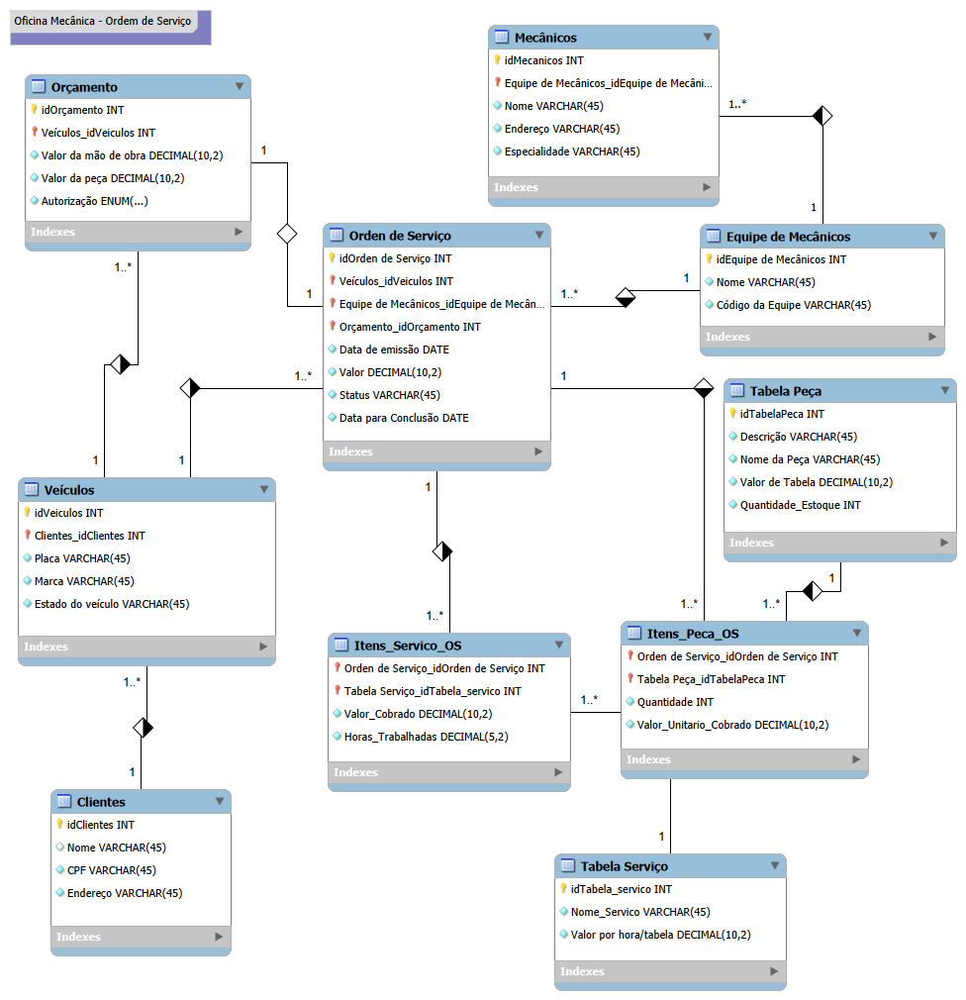

# 🔧 Sistema de Gerenciamento de Oficina Mecânica - Modelagem de Banco de Dados (MySQL)

## 📌 Descrição do Projeto

Este projeto consiste na modelagem conceitual, lógica e física de um banco de dados relacional para o gerenciamento de **Ordens de Serviço (OS)** em uma oficina mecânica, desenvolvido em **MySQL**. 

A arquitetura foi projetada e refinada até a **Terceira Forma Normal (3FN)**, garantindo a integridade transacional, rastreabilidade de orçamentos por veículo, controle de mão de obra e peças, além de suporte para análises financeiras e operacionais de dados.

# 🔧 Sistema de Gerenciamento de Oficina Mecânica - Modelagem de Banco de Dados (MySQL)

[](#)
[](#)
[](#)

Este repositório contém o projeto de banco de dados relacional para o sistema de controle e execução de **Ordens de Serviço (OS)** em uma oficina mecânica, desenvolvido em **MySQL**. 

O projeto foi desenvolvido como parte do desafio prático da formação **SQL Database Specialist** da **DIO (Digital Innovation One)** e passou por auditorias completas de arquitetura e normalização até a **Terceira Forma Normal (3FN)**.

---

## 📌 Contextualização e Regras de Negócio

O sistema gerencia todo o fluxo operacional da oficina, desde o cadastro do cliente e veículo até o orçamento, execução da OS e consumo de peças em estoque.

### Regras de Negócio Implementadas:
* **Clientes e Veículos:** Os clientes cadastram seus veículos na oficina. Um cliente pode possuir múltiplos veículos.
* **Orçamento Pró-Ativo:** O orçamento é gerado diretamente para o veículo em avaliação, contendo estimativas de mão de obra e peças com campo de autorização (`ENUM`).
* **Equipes de Mecânicos:** Os mecânicos são organizados em equipes especializadas. Cada Ordem de Serviço é atribuída a uma equipe responsável por avaliar e executar os trabalhos.
* **Ordem de Serviço (OS):** Vinculada ao veículo, orçamento aprovado e equipe responsável. Guarda datas de emissão/conclusão, valor total e status.
* **Serviços e Peças:**
  * **Serviços (`Itens_Servico_OS`):** Registra o nome do serviço, o valor por hora de tabela e as `Horas_Trabalhadas` reais na OS.
  * **Peças (`Itens_Peca_OS`):** Registra as peças utilizadas, quantidade aplicada, valor unitário cobrado e controle de `Quantidade_Estoque` no catálogo.

---

## 📐 Decisões de Arquitetura e Blindagem de Dados

1. **Modelagem em 3FN Limpa:** As tabelas associativas N:M (`Itens_Servico_OS` e `Itens_Peca_OS`) mantêm apenas as chaves estritamente necessárias, eliminando chaves redundantes propagadas.
2. **Preservação de Histórico Financeiro:** Todos os preços cobrados em serviços e peças são gravados na transação da OS (`Valor_Cobrado` e `Valor_Unitario_Cobrado`), garantindo que alterações posteriores na tabela de referência não alterem o histórico financeiro de ordens já fechadas.
3. **Auditoria de Horas e Estoque:** Suporte nativo para controle de tempo de serviço e estoque de peças.

---

## 📊 Diagrama de Entidade-Relacionamento (DER)



---

## 💻 Script DDL (MySQL)

```sql
CREATE DATABASE IF NOT EXISTS oficina_mecanica;
USE oficina_mecanica;

-- 1. Clientes
CREATE TABLE Clientes (
    idClientes INT AUTO_INCREMENT PRIMARY KEY,
    Nome VARCHAR(45) NOT NULL,
    CPF VARCHAR(45) NOT NULL UNIQUE,
    Endereco VARCHAR(45) NOT NULL
);

-- 2. Veículos
CREATE TABLE Veiculos (
    idVeiculos INT AUTO_INCREMENT PRIMARY KEY,
    Placa VARCHAR(45) NOT NULL UNIQUE,
    Marca VARCHAR(45) NOT NULL,
    Estado_do_veiculo VARCHAR(45),
    Clientes_idClientes INT NOT NULL,
    CONSTRAINT fk_veiculos_clientes FOREIGN KEY (Clientes_idClientes) 
        REFERENCES Clientes(idClientes) ON DELETE CASCADE
);

-- 3. Equipe de Mecânicos
CREATE TABLE Equipe_de_Mecanicos (
    idEquipe_de_Mecanicos INT AUTO_INCREMENT PRIMARY KEY,
    Nome VARCHAR(45) NOT NULL,
    Codigo_da_Equipe VARCHAR(45) NOT NULL UNIQUE
);

-- 4. Mecânicos
CREATE TABLE Mecanicos (
    idMecanicos INT AUTO_INCREMENT PRIMARY KEY,
    Nome VARCHAR(45) NOT NULL,
    Endereco VARCHAR(45),
    Especialidade VARCHAR(45) NOT NULL,
    Equipe_de_Mecanicos_idEquipe_de_Mecanicos INT NOT NULL,
    CONSTRAINT fk_mecanicos_equipe FOREIGN KEY (Equipe_de_Mecanicos_idEquipe_de_Mecanicos) 
        REFERENCES Equipe_de_Mecanicos(idEquipe_de_Mecanicos)
);

-- 5. Tabela Serviço (Catálogo)
CREATE TABLE Tabela_Servico (
    idTabela_servico INT AUTO_INCREMENT PRIMARY KEY,
    Nome_Servico VARCHAR(45) NOT NULL,
    Valor_por_hora_tabela DECIMAL(10,2) NOT NULL
);

-- 6. Tabela Peça (Catálogo)
CREATE TABLE Tabela_Peca (
    idTabelaPeca INT AUTO_INCREMENT PRIMARY KEY,
    Nome_da_Peca VARCHAR(45) NOT NULL,
    Descricao VARCHAR(45),
    Valor_de_Tabela DECIMAL(10,2) NOT NULL,
    Quantidade_Estoque INT NOT NULL DEFAULT 0
);

-- 7. Orçamento
CREATE TABLE Orcamento (
    idOrcamento INT AUTO_INCREMENT PRIMARY KEY,
    Veiculos_idVeiculos INT NOT NULL,
    Valor_da_mao_de_obra DECIMAL(10,2) DEFAULT 0.00,
    Valor_da_peca DECIMAL(10,2) DEFAULT 0.00,
    Autorizacao ENUM('Pendente', 'Aprovado', 'Recusado') DEFAULT 'Pendente',
    CONSTRAINT fk_orcamento_veiculo FOREIGN KEY (Veiculos_idVeiculos) 
        REFERENCES Veiculos(idVeiculos)
);

-- 8. Ordem de Serviço (OS)
CREATE TABLE Orden_de_Servico (
    idOrden_de_Servico INT AUTO_INCREMENT PRIMARY KEY,
    Data_de_emissao DATE NOT NULL,
    Valor DECIMAL(10,2) DEFAULT 0.00,
    Status VARCHAR(45) NOT NULL DEFAULT 'Em Avaliação',
    Data_para_Conclusao DATE,
    Veiculos_idVeiculos INT NOT NULL,
    Equipe_de_Mecanicos_idEquipe_de_Mecanicos INT NOT NULL,
    Orcamento_idOrcamento INT NULL,
    CONSTRAINT fk_os_veiculos FOREIGN KEY (Veiculos_idVeiculos) 
        REFERENCES Veiculos(idVeiculos),
    CONSTRAINT fk_os_equipe FOREIGN KEY (Equipe_de_Mecanicos_idEquipe_de_Mecanicos) 
        REFERENCES Equipe_de_Mecanicos(idEquipe_de_Mecanicos),
    CONSTRAINT fk_os_orcamento FOREIGN KEY (Orcamento_idOrcamento) 
        REFERENCES Orcamento(idOrcamento)
);

-- 9. Itens de Serviço na OS
CREATE TABLE Itens_Servico_OS (
    Orden_de_Servico_idOrden_de_Servico INT NOT NULL,
    Tabela_Servico_idTabela_servico INT NOT NULL,
    Valor_Cobrado DECIMAL(10,2) NOT NULL,
    Horas_Trabalhadas DECIMAL(5,2) NOT NULL DEFAULT 1.00,
    PRIMARY KEY (Orden_de_Servico_idOrden_de_Servico, Tabela_Servico_idTabela_servico),
    CONSTRAINT fk_itens_servico_os FOREIGN KEY (Orden_de_Servico_idOrden_de_Servico) 
        REFERENCES Orden_de_Servico(idOrden_de_Servico) ON DELETE CASCADE,
    CONSTRAINT fk_itens_servico_tabela FOREIGN KEY (Tabela_Servico_idTabela_servico) 
        REFERENCES Tabela_Servico(idTabela_servico)
);

-- 10. Itens de Peça na OS
CREATE TABLE Itens_Peca_OS (
    Orden_de_Servico_idOrden_de_Servico INT NOT NULL,
    Tabela_Peca_idTabelaPeca INT NOT NULL,
    Quantidade INT NOT NULL DEFAULT 1,
    Valor_Unitario_Cobrado DECIMAL(10,2) NOT NULL,
    PRIMARY KEY (Orden_de_Servico_idOrden_de_Servico, Tabela_Peca_idTabelaPeca),
    CONSTRAINT fk_itens_peca_os FOREIGN KEY (Orden_de_Servico_idOrden_de_Servico) 
        REFERENCES Orden_de_Servico(idOrden_de_Servico) ON DELETE CASCADE,
    CONSTRAINT fk_itens_peca_tabela FOREIGN KEY (Tabela_Peca_idTabelaPeca)

```
## ✍️ Autor

Desenvolvido por **Ricardo Freitas**  
*Estudante de Ciência de Dados & Entusiasta em Arquitetura de Dados.*

[](https://www.linkedin.com/in/ricardo-freitas-4144773b3/)
[](https://github.com/Freitas-Dias/ecommerce-database-design)
        REFERENCES Tabela_Peca(idTabelaPeca)
);
